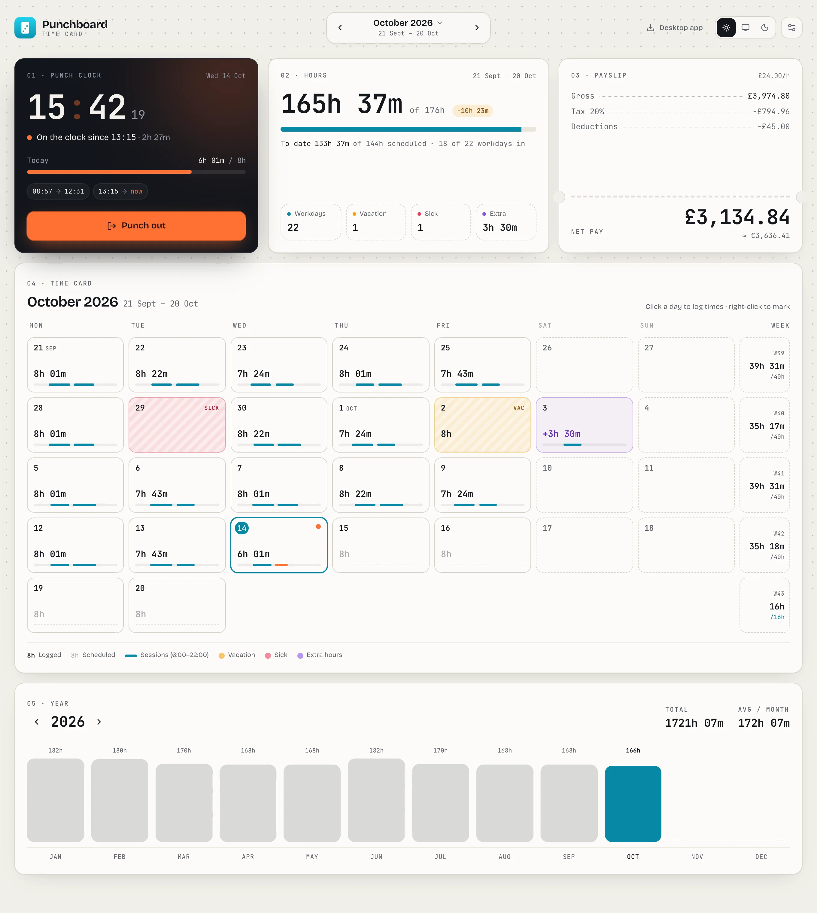

# Punchboard

A desktop app for tracking daily work hours, estimating pay, and keeping an
eye on your yearly workload — for macOS, Windows, and Linux.

Your data stays in a plain JSON file that you choose the location of, so it's
easy to sync with iCloud, Dropbox, or any folder you already back up.

**[quackbyte.dev/punchboard](https://quackbyte.dev/punchboard/)** —
marketing page, or jump straight into the
[browser app](https://quackbyte.dev/punchboard/app/).

<p align="center">
  <picture>
    <source srcset="site/assets/screens/dashboard-dark.webp" media="(prefers-color-scheme: dark)" />
    
  </picture>
</p>

## Features

- **Punch clock** — punch in and out for today with one click; the running
  session is tracked live and saved as a real start/end time.
- **Clocked sessions** — click any day on the time card to log sessions,
  either with quick entry (`9-13, 14-18:30`, `8:45 to 17`, or a plain total
  like `7.5` / `7h 30m`) or by editing start/end times directly. Each day
  shows a mini timeline of its sessions, and each session can carry a note.
- **Time rules** — optional automatic unpaid break on long days (minus any
  gaps you already took), punch rounding to 5/6/10/15/30 minutes, and an
  overtime rate for days off and, optionally, hours beyond the schedule.
  Rules apply when hours are counted, so recorded times never change.
- **Day exceptions** — mark days as vacation, sick leave, or holiday, with
  automatic exclusion from expected working hours.
- **Extra hours** — track hours on days off separately from the schedule.
- **Salary estimation** — set an hourly rate, tax percentage, and extra
  deductions to see estimated gross and net pay for the current payslip
  period (with a configurable payslip start day).
- **Currency conversion** — optionally show a second currency alongside your
  primary one, using a manual conversion rate.
- **Yearly overview** — a chart of hours worked per month across the year.
- **Weekly totals** — hours per ISO week against the scheduled hours.
- **Timesheet export** — download the period as CSV, or print / save a
  one-page PDF timesheet with sessions, notes, totals and pay.
- **Undo** — reset a day or delete a session by mistake? Undo it from the
  toast or with ⌘Z / Ctrl+Z.
- **Keyboard friendly** — arrow keys move around the time card, Enter edits
  a day, `T` jumps to today and ⌘, / Ctrl+, opens Settings.
- **Menu bar / tray** — a mini punch clock in the menu bar (macOS) or system
  tray, with the running time next to the icon.
- **Desktop extras** — a global ⌥⌘P / Ctrl+Alt+P punch shortcut, a "still
  on the clock?" reminder once the day's hours are done, an optional
  punch-in nudge on workdays, and open at login.
- **Import/export** — back up or move your data as a JSON file.
- **Light/dark theme**.
- **Auto-updates** on macOS, Windows, and Linux via `electron-updater`.

## Install

**macOS (Apple Silicon)** — via Homebrew:

```bash
brew install --cask quackbyte/tap/punchboard
```

Or download the latest release for your platform from the
[Releases page](https://github.com/QuackByte/punchboard/releases):

- **macOS** — `.dmg` or `.zip` (signed and notarized)
- **Windows** — `.exe` (NSIS installer)
- **Linux** — `.AppImage`

Installed apps check GitHub Releases for updates automatically (every 6
hours) and prompt to restart once a new version has downloaded — no manual
reinstalling needed.

## Development

Requires Node.js 22+.

```bash
npm install

# Run the renderer only, in a browser (fastest for UI work)
npm run dev

# Run the full Electron app in dev mode, with hot reload
npm run electron:dev

# Unit tests (Vitest) for the parsers, hour/pay maths and exports
npm test
```

Pull requests run the tests and a full build in CI.

### Building

```bash
# Build the web + electron bundles
npm run build

# Package a distributable for your current platform
npm run dist
```

### Project structure

- `src/` — React renderer (UI, state, business logic)
- `electron/` — Electron main process and preload scripts
- `build-resources/` — packaging assets (entitlements, afterPack hook)
- `site/` — static marketing page deployed to GitHub Pages, with the web
  build of `src/` nested at `/app`

### Stack

React, TypeScript, Vite, Tailwind CSS, Radix UI primitives (via
[shadcn/ui](https://ui.shadcn.com/)-style components), and Electron.

## Releases

Releases are automated with
[release-please](https://github.com/googleapis/release-please): merging to
`main` with conventional commits opens a release PR, and merging that PR
tags a release and triggers signed builds for all three platforms.

## License

[MIT](LICENSE)
